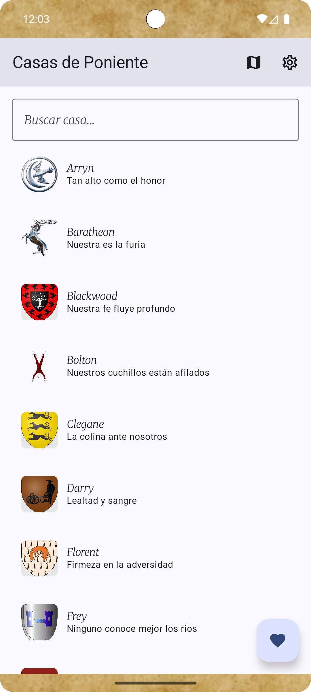
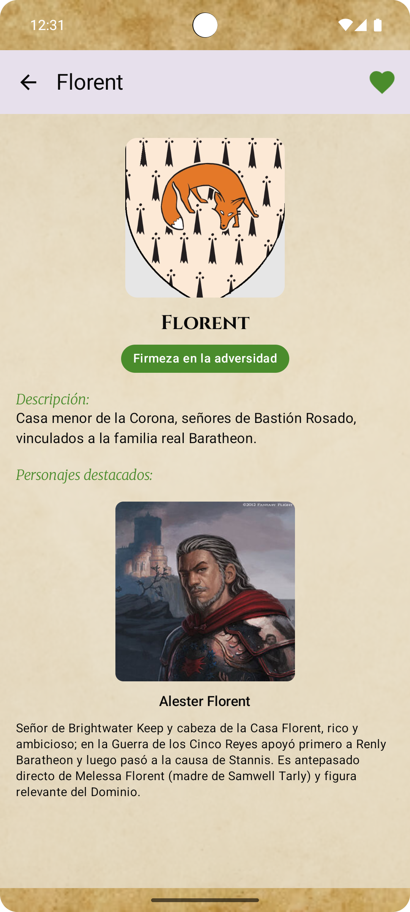
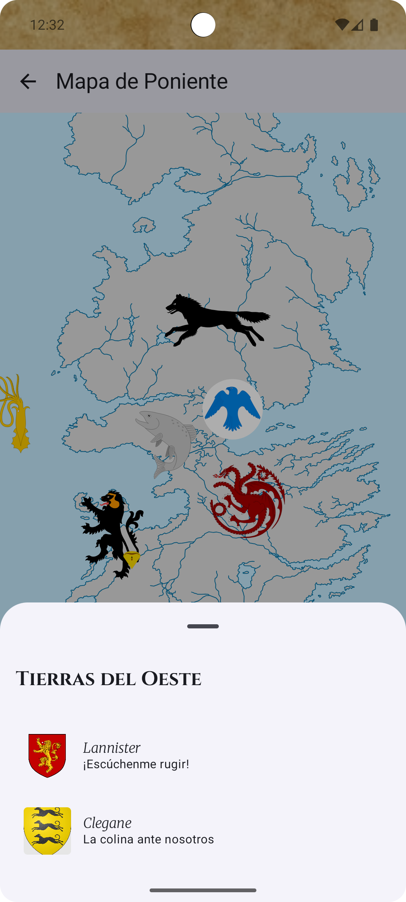
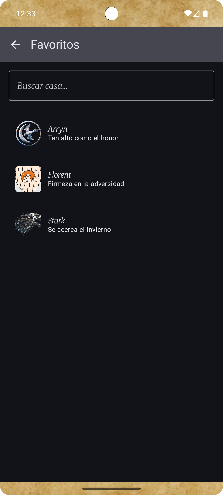

# 📱 Game of Thrones – Android App

Aplicación Android nativa desarrollada con **Jetpack Compose** que permite explorar las Casas de Poniente, sus detalles, personajes destacados y un mapa interactivo del mundo de *Game of Thrones*.  

Incluye favoritos, cambio de tema (oscuro/claro) y tests automatizados.

---

## 🎥 Demo

  


---

## ✨ Funcionalidades principales

- 🏰 **Lista de casas** con buscador.
- 📖 **Detalle de casa** con escudo, lema, descripción y personajes destacados.
- ⭐ **Favoritos persistentes** con Room + DataStore.
- 🗺️ **Mapa interactivo** con regiones y acceso rápido a detalles.
- 🎨 **Modo oscuro/claro** y paletas personalizadas por cada casa.
- ⚡ **Animaciones** suaves en botones y transiciones de pantallas.

---

## 🛠️ Tecnologías usadas

- **Lenguaje**: Kotlin  
- **UI**: Jetpack Compose, Material 3  
- **Arquitectura**: MVVM + StateFlow  
- **Inyección de dependencias**: Hilt (Dagger)  
- **Persistencia**: Room + DataStore  
- **Imágenes**: Coil  
- **Navegación**: Navigation Compose + Accompanist Navigation Animation  
- **Testing**: JUnit, Turbine, Coroutines-Test, Jetpack Compose UI Test

---

## 🧪 Testing

La aplicación incluye **tests automatizados** para garantizar calidad:

- ✅ **Unit Tests**  
  - `FavoritesFlowTest`: Verifica que al marcar y desmarcar una casa como favorita, el estado del Flow cambia correctamente (`false → true → false`).

- ✅ **UI Tests**  
  - `SearchableHouseListScreenTest`: Simula escribir en el buscador y valida que la lista de casas se filtra dinámicamente.  
  - Usa **Compose UI Test** (`createComposeRule`, `onNodeWithTag`, etc.) para comprobar que los elementos correctos aparecen en pantalla.

  


---

## 📸 Screenshots

|        Lista de casas       |       Detalle de casa         |      Mapa interactivo    |          Favoritos                 |
|      ----------------       |       -----------------       |     ------------------   |          -----------               |
|              |              |            |                |


---

## 🚀 Cómo correr el proyecto

1. Clonar el repositorio:
   ```bash
   git clone https://github.com/tuusuario/game-of-thrones-app.git

2. Abrir en Android Studio.

3. Compilar con Gradle.

4. Ejecutar en emulador o dispositivo físico.

👨‍💻 Autor

Desarrollado por Ignacio Nicolas Lupo

📧 ignaciolupo98@gmail.com
💼 LinkedIn/ https://www.linkedin.com/in/ignacio-lupo-484352252/
